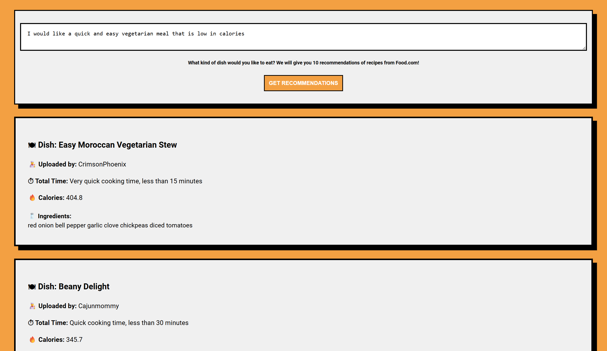

# 🍽️ Dish Recommender Web App

This is a full stack web application that uses content based recommendation to recommend 10 dishes from Food.com based on user input. The project leverages **TF-IDF vectorisation** and **cosine similarity** to compare user queries with thousands of recipes.

## 🔍 How it works

Users can input a description.

The app will return 10 matching recipes based on:

- Keywords
- Ingredients
- Description
- Recipe category
- Total cooking time
- Caloric information


## 🖼️ What it looks like 



---

## 🛠️ Tech Stack

- 🧠 **Text-Based Recommender, NLP** using TF-IDF + Cosine Similarity using methods from **sklearn**. 
- ⚛️ **Frontend** built with **React**
- 🐍 **Backend** powered by **Flask** (Python), data taken and cleaned from CSV file using **Pandas** 
- **Regex** for text cleaning

## Dataset
- 📄 Uses a **Kaggle dataset** licensed under **CC0: Public Domain**.
- Dataset link: [Kaggle](https://www.kaggle.com/datasets/irkaal/foodcom-recipes-and-reviews)
- Dataset Name: Food.com - Recipes and Reviews
- Dataset uploaded by: Alvin 

## 🚀 Getting Started

### 1. Clone the repository
```bash
git clone https://github.com/yourusername/dish-recommender.git
cd dish-recommender
```
### 2. Start servers

```bash
cd backend 
python app.py 
cd frontend 
cd dish-deciders-react
npm run dev 
```


